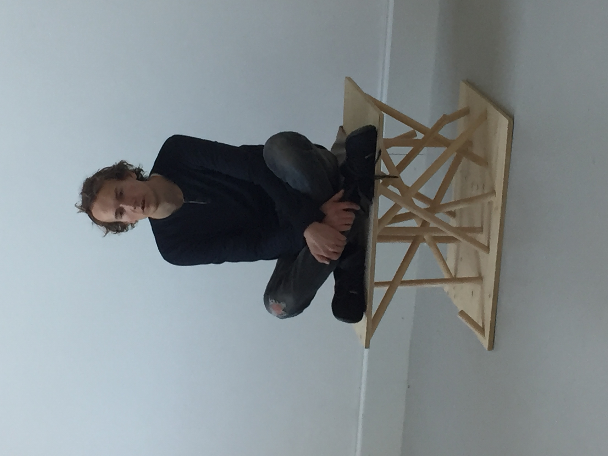
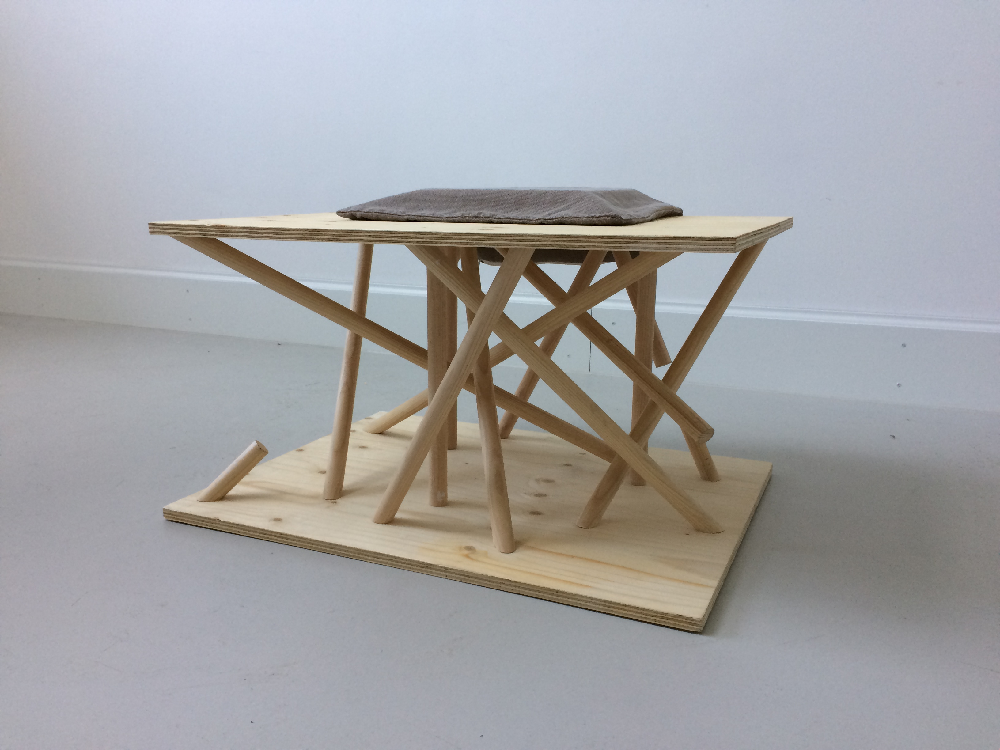
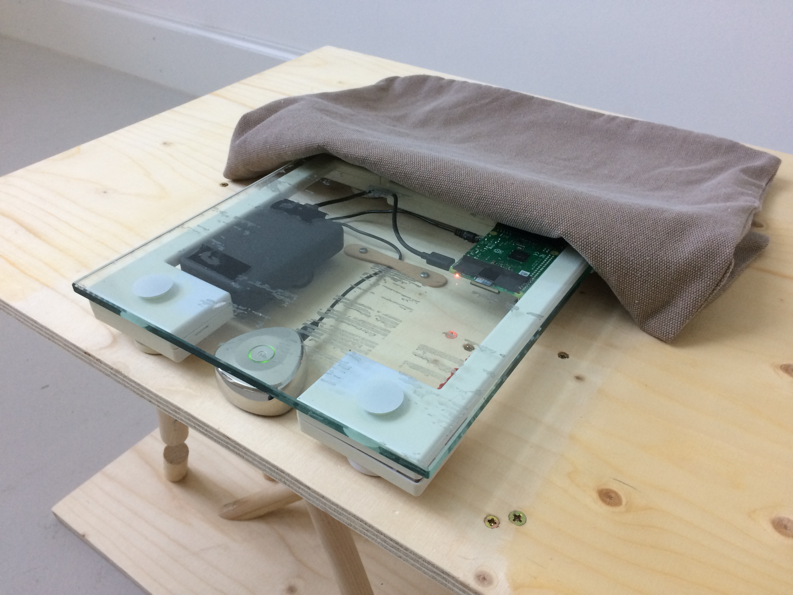

# Sich Niederlassen

Interactive sculpture made from wood, fabric and electronics, for the class "Freie Kunst", part of the Industrial Design curriculum at Technical University Munich, taken in WS2019/2020.

# Concept

The sculpture represents and facilitates the effects of relaxation and meditation by offering its 
users a dedicated space and creating a physical stimulus to concentrate on their body and shut 
out external noise sources. 
While the pillow invites sitting down to rest, the pedestal looks unstable and unsafe, 
a nod to our struggle to relax in the real world.
The mess of seemingly random and partly uncompleted pillars is a representation of the uncertainty and
unfinished paths we take in life, yet despite that they are sturdy and can easily carry a person. 
If they do sit down their perspective shifts from seeing the mess to being above it and letting it 
support them.

After sitting and doing nothing for a few seconds, a low-frequency vibration can be clearly felt in
the pedestal. It hits hard and then gets softer as time progresses, similar to a sound bowl. The longer
the user sits and tries to feel when this sensation ends, the harder they have to concentrate on their own
body, and their looks get empty as they try hard to feel where the feeling ends, and where their
imagination begins.

# Technology

The pedestal runs on a 10'000mAh power bank, powering a RaspberryPi, and the Tunebug Vibe resonance speaker. They are positioned underneath a personal scale that was modified so its activation switch could be read out by the RasPi. When someone sits down, a sample of sine wave at F-1 (21,826Hz) with an exponential decay envelope is triggered. The frequency is too low for the human ear to pick up, but and can be felt distinctly.

The resonance speaker and power bank have to be charged overnight and are then ready for at least 8 hours of light use.
